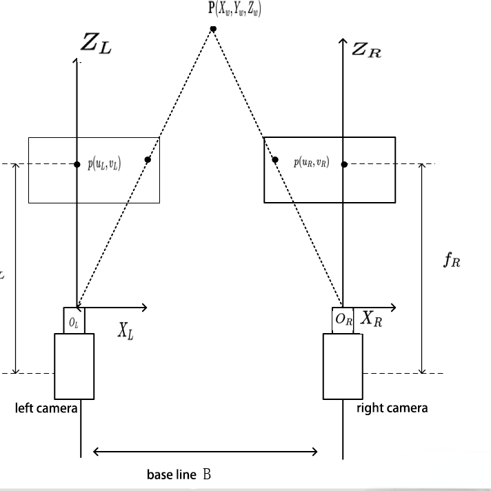

# The Application Task of Laser Point Measurement

## 1. Instructions
This program aims to detect a laser pointer through a webcam feed, with the capability to identify the laser pointer up to a distance of 2 meters, allowing for a tolerance of 10 cm.

## 2. Quick Start
### 2.1 Dependencies
The OpenCV and NumPy libraries are reqired.
```
pip install opencv-python numpy
```
### 2.2 Run
- Calibrate and fix two cameas in parallel to each other with a certain distance
- Record the distance and the parameter of camera into the variables at the beginning of the code

## 3. Principles
- I utilized stereo vision principles to achieve the goal. 

- This method uses the concept of triangulation based on the disparity between the positions of the laser point in the images from each camera. With a known baseline (distance between the two cameras) and the disparity (difference in the horizontal position of the laser point between the two camera images), you can estimate the depth (distance) of the laser point. The general method looks like this:

- Different form the photo, our two cameras are parallel to each other for conveniency.

- Formula for Distance Calculation: The distance(depth) `Z=𝑓⋅B/d`
  - **𝑓** is the focal length of the cameras (in pixels)
  - **B** is the baseline (distance between the two cameras)
  - **d** is the disparity (difference in horizontal positions of the laser point in the two camera frames).
